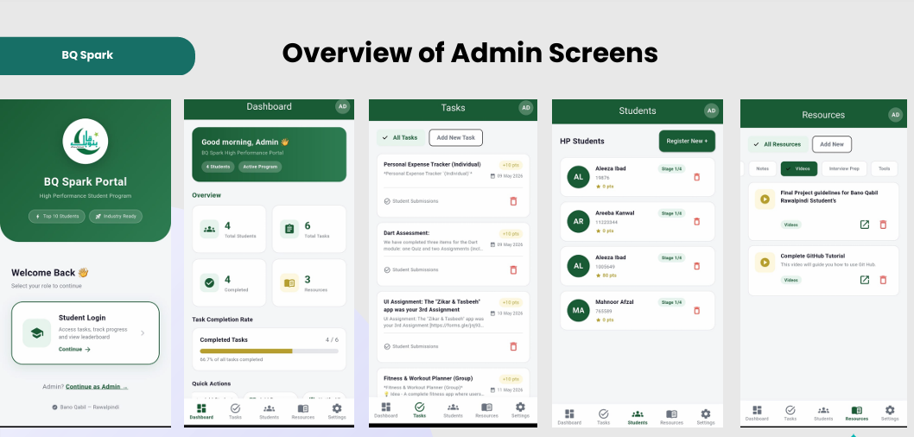
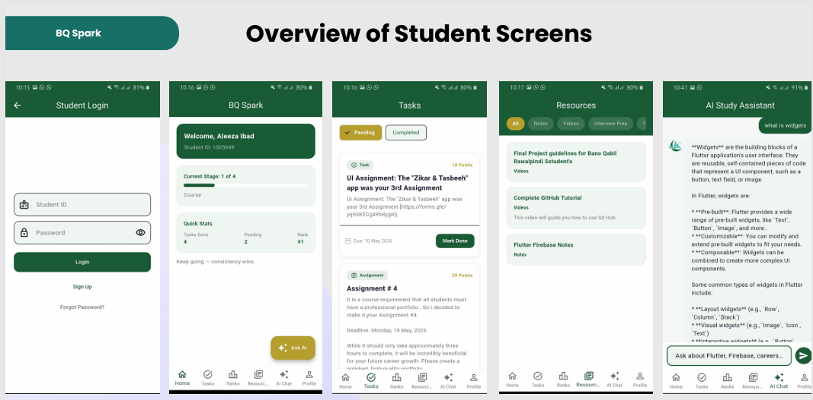

# BQ Spark High Performance Student Portal

A modern, full-featured Flutter application designed to manage and track the performance of students in the BQ Spark High Performance Track. This portal provides a seamless interface for both students and administrators to handle tasks, resources, and progress tracking.

## 🚀 Features

### For Students
- **Real-time Task Management**: View pending and completed tasks with deadlines and point rewards.
- **Assignment Submissions**: Integrated flow for submitting assignments via Google Forms or file uploads.
- **Resource Center**: Access learning materials, PDF notes, videos, and interview preparation tools.
- **Leaderboard**: Track performance rankings relative to peers in the High Performance Track.
- **Profile Customization**: Manage personal details and external links like GitHub.
- **AI Chat Support**: Integrated AI assistant for student queries.
- **Push Notifications**: Stay updated with real-time announcements from administrators.

### For Administrators
- **Task Management**: Create, edit, and delete tasks with specific points and due dates.
- **Student Management**: Register new students, update their current stages, and monitor overall performance.
- **Resource Management**: Upload PDF notes directly to Firebase Storage or share external links.
- **Broadcast Notifications**: Send announcements to all students instantly using Firebase Cloud Messaging.
- **Completion Stats**: Monitor task completion rates across the program.

## 🛠️ Tech Stack
- **Framework**: [Flutter](https://flutter.dev/) (Targeting Android, iOS, and Web)
- **Backend**: [Firebase](https://firebase.google.com/)
    - **Authentication**: Email/ID based login system.
    - **Firestore**: Scalable NoSQL database for real-time data sync.
    - **Cloud Messaging**: Push notifications.
    - **Cloud Storage**: Hosting for student resources and PDF notes.
    - **Remote Config**: Dynamic app configuration (Maintenance mode, etc.).
    - **Crashlytics**: Real-time crash reporting.
- **State Management**: [Provider](https://pub.dev/packages/provider)
- **Architecture**: Clean, modular folder structure.

## 📋 Prerequisites

- Flutter SDK (v3.11.0 or higher)
- Dart SDK
- Android Studio / VS Code
- A Firebase Project (Google Services JSON/Plist configured)

## ⚙️ Installation & Setup

1. **Clone the repository**:
   ```bash
   git clone https://github.com/yourusername/bq_spark_high_performance_student_portal.git
   cd bq_spark_high_performance_student_portal
   ```

2. **Install dependencies**:
   ```bash
   flutter pub get
   ```

3. **Firebase Configuration**:
    - Create a project on the [Firebase Console](https://console.firebase.google.com/).
    - Add an Android/iOS app to your Firebase project.
    - Download `google-services.json` (for Android) and `GoogleService-Info.plist` (for iOS).
    - Place `google-services.json` in `android/app/` and `GoogleService-Info.plist` in `ios/Runner/`.

4. **Run the app**:
   ```bash
   flutter run
   ```

## 📂 Project Structure

```text
lib/
├── firebase/     # Firebase initialization and error handling
├── models/       # Data models (Task, User, Resource)
├── providers/    # State management logic
├── screens/      # UI Screens (Admin and Student sections)
│   ├── admin/    # Admin-only functionality
│   └── student/  # Student-specific screens
├── services/     # Business logic & API calls (Firestore, Auth, AI)
├── theme/        # App branding and colors
├── utils/        # Global utilities and constants
└── widgets/      # Reusable UI components
```

## 🔒 Security

This application uses Firestore Security Rules to ensure:
- Students can only update their own profiles.
- Only authenticated administrators can create tasks or manage other users.
- Public resources are read-only for students.

## 📝 License

This project is proprietary. All rights reserved.

## 📸 Screenshots

### Admin Panel


### Student Panel


---
Developed for **Bano Qabil — Rawalpindi**
